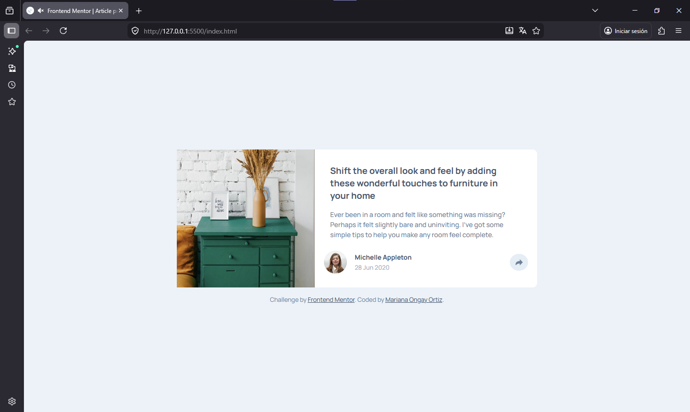
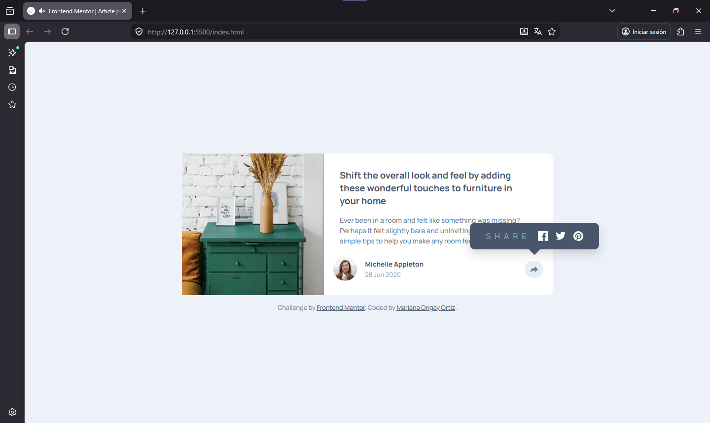
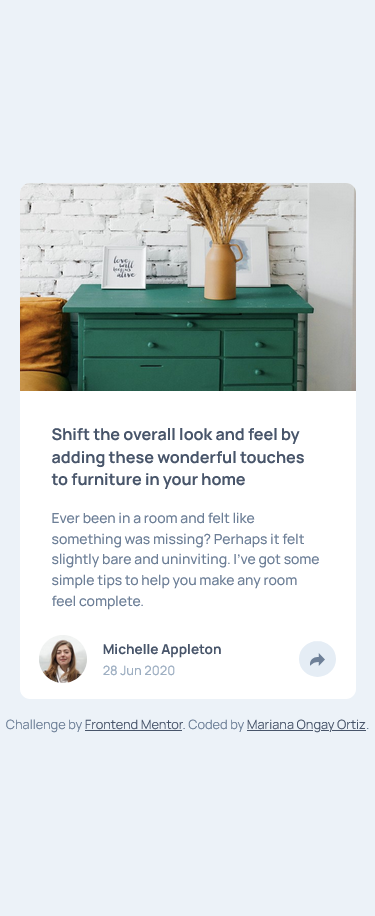
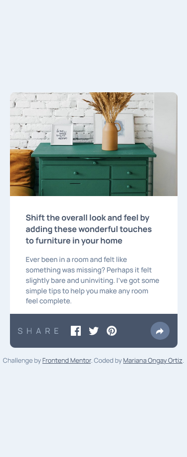

# Frontend Mentor - Testimonials grid section solution

Solución de [Article preview component challenge on Frontend Mentor](https://www.frontendmentor.io/challenges/article-preview-component-dYBN_pYFT).  

### Screenshot
Diseño desktop

Diseño desktop active state

Diseño movil

Diseño movil active state

### Comandos

    npm install

    npm install -g sass

    sass scss/styles.scss css/styles.css

    sass --watch scss:css

## Author

- Website - Mariana Ongay Ortiz
- Frontend Mentor - [@MarianaOngay17](https://www.frontendmentor.io/profile/MarianaOngay17)
